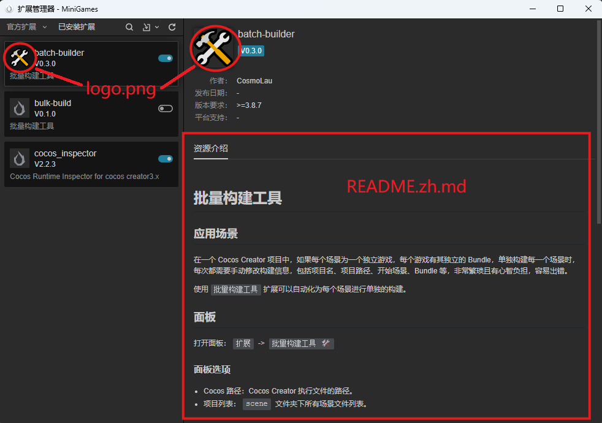
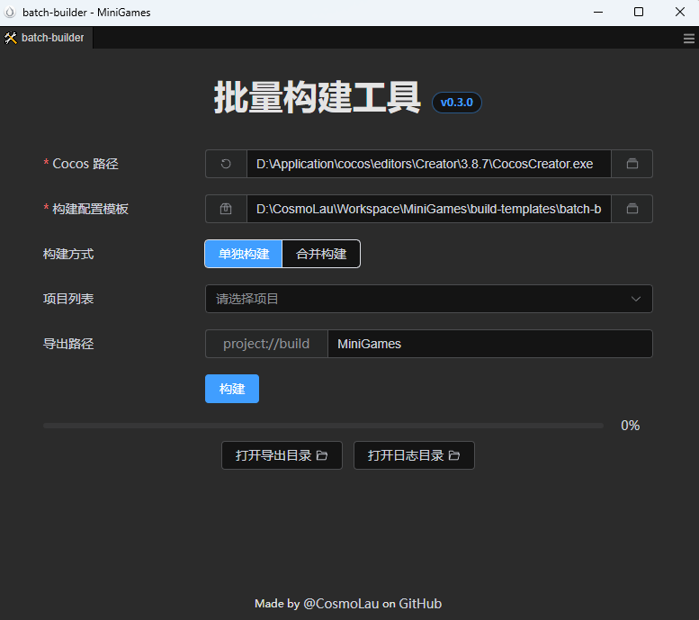

# Cocos Creator 扩展插件的开发与维护

本篇文章以我的开源扩展插件 [batch-builder](https://github.com/CosmoLau/batch-builder) 作为案例，讲述 Cocos Creator 扩展插件在开发时如何有效的进行版本管理，并搭建一个自动化流水线来用于扩展插件的打包发布与版本检查。

> ***说明***：本篇文章未使用 AI 参与撰写与润色，作为案例的开源插件采用 99.9% 古法编码制作而成，不是瞧不起 AI，而是 AI 太贵用不起，请给我的项目[点个 Star](https://github.com/CosmoLau/batch-builder)，或者在[爱发电主页](https://www.ifdian.net/a/CosmoLau?utm_source=copylink&utm_medium=link)以及 [ko-fi](https://ko-fi.com/Z8Z31TPDA1) 让我能摆脱古法时代！

## 项目准备

为了降低扩展插件开发的门槛，这个项目使用 Cocos Creator 3.8.7 中提供的 `Vue-Element-UI 面板` 作为扩展插件模板来进行开发。大体上来说，这个模板相当于是一个比较标准的 WEB 项目。

## 版本管理

在对扩展插件进行版本管理时，需要分两种情况来考虑。

### 独立仓库

如果扩展插件需要维护统一的版本，用于多个 Cocos 项目中，那么将创建好的扩展插件项目整个初始化为 Git 项目，此时 `.gitignore` 中需要**添加**以下内容：

```gitignore
# npm
node_modules
# 构建产物
/dist
```

然后推荐将扩展插件项目转移到其他路径下，**不要放在 Cocos 项目下**，依次来将扩展差将与项目分开，需要进行开发时，在 Cocos Creator 编辑器中 `扩展管理器` 里 `导入扩展文件(.zip)` 旁**下拉菜单**，通过 `开发者导入` 来将整个扩展插件项目进行导入，这会在原本 Cocos 项目下的 `extensions` 目录中创建一个软链接用来在开发时使用。

### Cocos 项目仓库

如果扩展插件就专门为这一个 Cocos 项目而开发的，那完全可以一并提交到 Cocos 的 Git 仓库中，这时就需要确认 Cocos 项目的 `.gitignore` 忽略文件：

```gitignore
# npm 必须忽略，否则会增加仓库体积
node_modules
# 可选，推荐忽略构建产物
# 第一次拉取仓库时 build 一遍即可
/extensions/${扩展插件名}/dist
```

***注意***：这里的 dist 忽略需要精确到扩展插件，避免把其他从扩展商店下载的插件给忽略了。

## 自动化流水线

自动化流水线主要是用于扩展插件作为独立仓库时，用来自动化构建打包与发布。

如果提交到 Cocos 项目的仓库中，一般来说只需要拉取代码后，执行一遍 build 命令即可，或者编写一个 `git hooks`，用来在拉取代码时，如果有扩展插件中的文件变动，自动执行一遍 build 命令，本篇文章不涉及这个内容，就不详细说明，可以直接让 AI 写一个钩子脚本。

当作为独立仓库提交时，如果提交的远端 Git 仓库支持 CI/CD，就可以编写一套自动化流水线来构建并发布扩展插件包，这里我们以 GitHub Actions 作为例子，参考 [release.yml](https://github.com/CosmoLau/batch-builder/blob/main/.github/workflows/release.yml)：

```yaml
name: Release

permissions:
  contents: write

# 推送 v 开头的标签时触发这个 Action
on:
  push:
    tags:
      - 'v*'

jobs:
  build:
    runs-on: ubuntu-latest

    steps:
      # 检出仓库
      - name: Checkout repository
        uses: actions/checkout@v6
        with:
          # 这里 fetch-depth 设置为 0，是下面 changelog 需要
          fetch-depth: 0

      # 设置 node 环境
      - name: Setup Node.js
        uses: actions/setup-node@v6
        with:
          registry-url: https://registry.npmjs.org/
          # 可以更换为开发环境中使用的 node 版本
          node-version: lts/*
          cache: 'npm'

      # 安装依赖
      - name: Install dependencies
        run: npm install

      # 构建项目
      - name: Build project
        run: npm run build

      # 这里读取 package.json 中的 name 来命名压缩包
      - name: Read package name and package files
        id: meta
        run: |
          PKG_NAME=$(node -p "require('./package.json').name")
          echo "pkg_name=${PKG_NAME}" >> "$GITHUB_OUTPUT"

      # 压缩打包
      # 其中 dist、i18n、package.json 是必须的
      # 其他内容是否打包，需要根据项目情况而定
      - name: Create zip archive
        run: |
          ZIP_NAME="${{ steps.meta.outputs.pkg_name }}.zip"
          zip -r "${ZIP_NAME}" \
            dist \
            i18n \
            logo.png \
            README* \
            package.json
          echo "Created archive: ${ZIP_NAME}"

      # 发布打包后的压缩包
      - name: Upload release asset
        uses: softprops/action-gh-release@v2
        with:
          files: ${{ steps.meta.outputs.pkg_name }}.zip

      # 自动化生成 changelog
      - name: Write changelog
        run: npx changelogithub # or changelogithub@0.12 to ensure a stable result
        env:
          GITHUB_TOKEN: ${{secrets.GITHUB_TOKEN}}

```

在压缩打包阶段，其实核心的只有 `dist` 和 `package.json` 两个内容，其他的都可以不要，但爱看官方文档的小伙伴就会问了，在[打包扩展](https://docs.cocos.com/creator/3.8/manual/zh/editor/extension/install.html#%E6%89%93%E5%8C%85%E6%89%A9%E5%B1%95)里说：

> `dist`、`i18n`、`node_module`、`package.json`、`static` 这几个文件（夹）为必选，缺一不可

我们这里详细盘一下：

| 文件（夹）   | 必选 | 说明                                                                    |
| ------------ | ---- | ----------------------------------------------------------------------- |
| dist         | √    | 扩展插件产物                                                            |
| i18n         |      | 如果不涉及 i18n，这是可选的                                             |
| node_modules |      | vite 在构建时，会进行 tree shaking，需要的 npm 包实际上已经在 dist 中了 |
| package.json | √    | Cocos Creator 的扩展管理器会根据这个来运行扩展                          |
| static       |      | 这个看项目需要，如果没有用到，可以不用打包                              |

那么代码里的 `logo.png` 和 `README*` 又是干嘛的呢？



* **`logo.png`**：在扩展管理器中显示的**扩展插件图标**
* **`README.zh.md`**：在扩展管理器中显示的**资源介绍**

> 这里吐槽一下，既然编辑器不开源，这些奇奇怪怪的规则至少也该写在文档里吧，`平台支持` 这一字段连官方扩展都从来没用过，不会官方自己都忘了这是怎么用的吧？

另外，流水线的最后一步是自动化编写发布时的 ChangeLog，这个需要在编写 git commit 时遵循[约定式提交](https://www.conventionalcommits.org/zh-hans/v1.0.0/)规范。

### 版本检测

如果需要做版本检测，可以使用 [GitHub API](https://docs.github.com/zh/rest?apiVersion=2026-03-10) 来获取 Release 中最新发布的版本号，[示例插件中的版本检测](https://github.com/CosmoLau/batch-builder/blob/main/src/panels/scripts/checkUpdate.ts)就使用了这个方法来判断是否有新版本，然后通过 [https://github.com/CosmoLau/batch-builder/releases/latest](https://github.com/CosmoLau/batch-builder/releases/latest) 来跳转最新发布页，

## 踩坑经验

### 依赖包版本

在这个扩展插件模板中，除了 `vite` 以外，大部分的依赖包都可以放心升级到最新版本，使用 `npm install xxx@latest` 升级即可。

那么为什么 `vite` 依赖不行呢？因为模板中使用了一个官方编写的 `@cocos-fe/vite-plugin-cocos-panel` vite 插件来处理打包构建的流程，但是这个 vite 插件并没有开源，而插件本身没有对 vite 新版本进行兼容性处理，所以唯独 `vite` 依赖不要进行升级。

### node 版本

在示例项目中，会发现有个 [.node-version](https://github.com/CosmoLau/batch-builder/blob/main/.node-version)，与 `package.json` 中的 `engines.node` 字段相同，都设置为了 `20.15.1` 这个 node 版本号。

这么做的目的是告诉开发者，当这个插件在 Cocos Creator 编辑器中运行时，打印 `process.version` 显示的版本号，也就是说 Cocos Creator 的 node 运行环境为 `20.15.1`。

发现这个问题是在示例项目中使用 node 内置的 `fs.glob` 时，发现编辑器中并不支持，这种情况就老老实实用 `glob` npm 包就行了。

### Element-plus 的根 DOM

如果是用 `Vue-Element-UI 面板` 这个模板创建扩展插件项目的话，示例代码中已经提供了依赖注入，在 `App.vue` 中有如下代码：

```vue
<script setup lang="ts">
import { inject } from 'vue';
import { ElMessage } from 'element-plus';
import { keyAppRoot, keyMessage } from './provide-inject';

const appRootDom = inject(keyAppRoot);
const message = inject(keyMessage)!;

const open = () => {
    ElMessage({
        message: 'show message',
        appendTo: appRootDom,
    });
};

function open2() {
    message({ message: 'show inject message' });
}

</script>

<template>
    <!-- ... -->
</template>

<style scoped>
/* ... */
</style>
```

在 Element-plus 中的很多弹窗类组件，需要挂载到根 DOM 下才能正常显示，也就是代码中的 `appRootDom`，一般来说，这种类型的组件都会提供一个 `append-to` 属性，这个属性就是在这里使用的，例如在 `el-tooltip` 中使用：

```vue
<el-tooltip
    content="打开构建面板，导出构建配置" 
    :append-to="appRootDom" 
    effect="light"
    placement="bottom">
</el-tooltip>
```

### 外部链接

如果在扩展插件中使用 `windows.open` 方法来打开外部链接，会打开一个新的 Electron 窗口来打开。

想要解决这个方法，要么使用官方的 `<ui-link>` 标签，要么使用 `<el-link>` 标签，示例插件中用来触发 Element-plus 标签事件的方法来进行了 hack 操作：

```ts
function linkToRelease() {
    if (!canUpdate.value) return;
    // 使用 window.open 会打开一个 Electron 窗口
    // 所以这里模拟 el-link 点击来打开链接
    (githubLink.value.$el as HTMLElement).click();
}
```

### 连续构建

在扩展插件开发时，遇到过好几次构建后脚本缺失的情况，参见[3.8.7 命令行连续构建，会有几次出现脚本丢失的情况](https://github.com/cocos/cocos-engine/issues/19024)这个 issue。

由于中途跟换过开发设备，感觉这个问题在低配置的机器上出现概率比较大，如果各位开发者在开发中仍然遇到这个问题，可以参考示例扩展插件中的实现：

* 通过 `is missing or invalid` 类似的日志内容来判断是否再构建时有丢失脚本。
* 在丢失脚本的情况下，对构建进行重试。
* 构建之前检查资源数据库是否准备好（`query-ready` 消息），这个其实也没法保证构建不会丢失脚本。

## 示例扩展插件简介

> 本篇文章的示例扩展插件已开源，详细说明可以到 [batch-builder 仓库](https://github.com/CosmoLau/batch-builder)和[插件资源介绍](https://github.com/CosmoLau/batch-builder/blob/main/README.zh.md)中查看，这里只做简单介绍。

batch-builder 是一个批量构建项目的插件，由于项目需求，Cocos Creator 中的每个 `.scene` 场景文件都作为一个单独的项目进行打包构建，其数量在几十个左右，未来可能会更多。在这种情况下，如果要使用 Cocos 的构建面板，每个项目都需要单独勾选场景和 bundle，在场景文件数量非常多时，这是非常低效且容易犯错的重复工作，所以本扩展插件应运而生。

为了减小项目体积，每个场景文件专属的资源会放在同名的 bundle 包下，而整个项目共用的资源会放在 `resources` 目录下，做好这个约定后，才能统一构建流程。

这个扩展插件的构建方式是基于**命令行**的，这样才能对构建配置进行高度自定义，所以这里有个可以优化的点，在使用这个扩展插件时，需要先在 `构建面板` 中对任意一个项目进行一次正常构建，构建成功后将构建配置文件进行导出，以供扩展插件使用。

通过 `扩展` -> `批量构建工具 🛠️` 打开扩展的面板后，填入所需内容，就可以在 `项目列表` 里多选需要批量构建的场景文件，然后点击构建即可。



## 结语

这篇文章和这个插件如果再不发布，等 `PinK` IDE 和 `Cocos-cli` 正式上线，就要过时了:cry:。为了证明在 Creator 时期待过，以此为纪念。

我相信 AI 应该能轻松复刻这个扩展插件，但是 Cocos 在 Creator 时期，文档别说是 AI 不友好了，甚至是“人类不友好”，希望 Cocos 能在 SUD 接手下，有个体面的~~结局~~未来。
