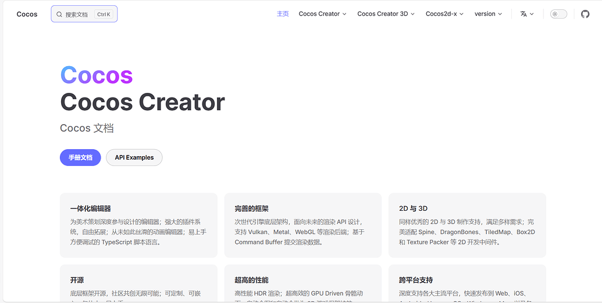
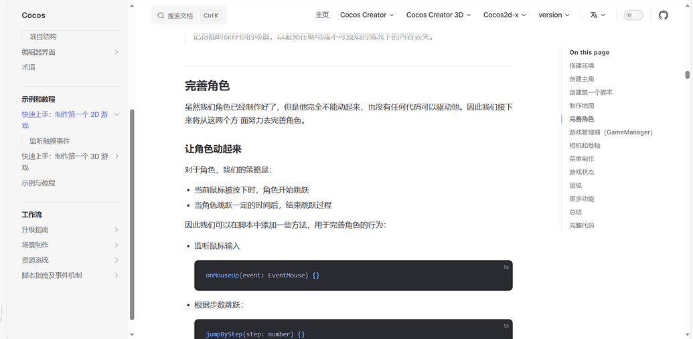
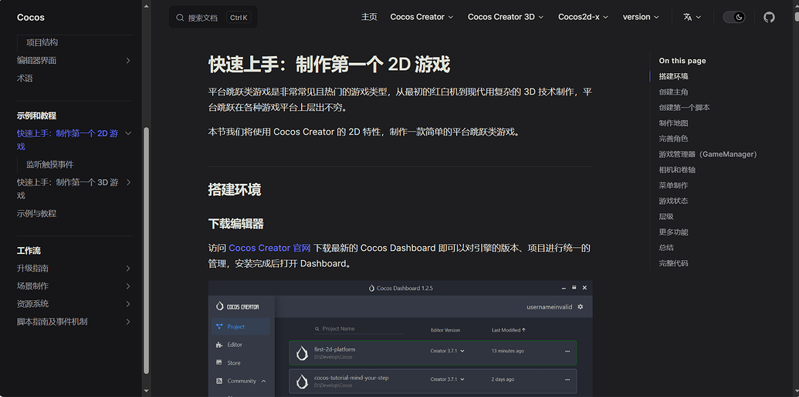
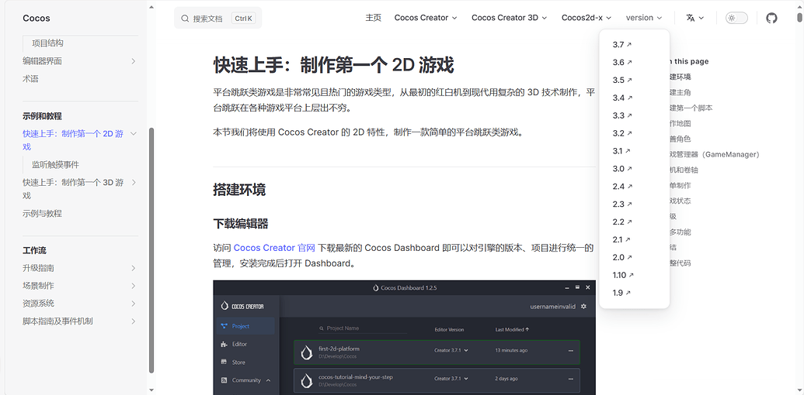

> 原文链接：https://forum.cocos.org/t/topic/150946
> ***注***：官方文档已移植为 VitePress 版本，参阅[Cocos Creator 用户手册](https://docs.cocos.com/creator/3.8/manual/zh/)

众所周知，Cocos 文档是使用 GitBook 发布的，如今已经有了更多成熟的静态网站生成器来构建个性化的开发文档，那么 Cocos 文档是不是也能换件新衣服呢？

正巧最近在学 Vue3 的时候，发现 Vue3 是由 [VitePress](https://github.com/vuejs/vitepress) 构建的，作为出名的前端技术团队维护的静态站点生成器，想必有其特别之处，跑去看了下 [VitePress 开发文档](https://vitepress.dev)，没想到上手如此的简单快捷，就萌生了移植 Cocos 文档的想法。

先上效果图：









如果觉得效果还不错，可以到 https://www.cosmolau.top/docs/cocos/ 在线体验一下，由于移植的工作量主要在于侧边栏的移植，目前 500 多篇文章只有 100 多篇显示在了侧边栏，这还只是中文文档（英文文档也是 500 篇），所以在线版的并不完整。感兴趣的话可以到 [GitHub 仓库](https://github.com/CosmoLau/cocos-docs-vitepress) 来参与移植，或者 fork 下来自己把玩也行。

## 自动化移植

手动移植是最笨的方法，而且非常消磨精力，所以就得考虑下自动化移植。

移植主要的内容是侧边栏，GitBook 的侧边栏目录写在一个 Markdown 文件中，想要自动化移植，可以使用 `mdast-util-from-markdown` Nodejs 库来读取 `Markdown` 的抽象语法树，然后再生成一份对应的 JSON 格式目录配置，粘贴到 VitePress 项目的 `config.ts` 中就行了。

限于我本人能力太菜，精力有限，这个课题就交给感兴趣的同学去研究吧。

## VitePress 移植踩坑

如果你想了解更多，下面我会分享我在移植过程中遇到的各种坑。

## img 标签路径错误

在 Cocos 官方文档中，相当部分的图片使用了 `img` 标签来引入，例如：

```html
# 使用 JSB 手动绑定

...

<a href="jsb/infrastructure.png"></a>

<div style="text-align:center"><p>新版 ABCmouse 的应用架构：基于 callStaticMethod 与 evalString 进行通信</p></div>
```

这个 `Markdown` 文件在开发时不会报错，但是在构建时就会报如下的错误：

```shell
build error:

Error: [vite]: Rollup failed to resolve import "jsb/infrastructure.png" from "E:/myWorkSpace/docs/cocos-docs-vitepress/docs/zh/manual/advanced-topics/jsb-manual-binding.md".

This is most likely unintended because it can break your application at runtime.

If you do want to externalize this module explicitly add it to

build.rollupOptions.external
```

这个报错困扰了我很久，在 VitePress 的 GitHub 仓库的 issue 中也没能找到解决方案。最终发现是因为引用的路径有误，正确的路径应该加上 “./”，做法如下：

```html
<a href="./jsb/infrastructure.png"></a>

```

> _巧用 VSCode 的搜索功能来批量替换。_

## 丢失终止标签

```shell
Element is missing end tag
```

有些标签是需要成对的，会有一个形如 `</>` 的终止标签，如果遇到这个报错，就得看看是不是哪个标签少了个 `/`。

## 错误的扩展名

cocos-docs 中部分图片使用的大写字母 `.PNG` 结尾，这也会使 VitePress 在构建时报错，修改成小写 `.png` 即可，图片的扩展名也需要改成小写 `.png`。（这个问题不是 BUG，具体参考这个 [issue](https://github.com/vuejs/vitepress/issues/3748)）

还有几个报错，相对这几个都是小问题，可以去 `VitePress` 上搜相关的 `issue`，不过还是吐槽一句，终归还是部分 `Markdown` 文档不够规范。

## 结尾

最近看到 Dashboard 马上要翻新了，手册文档是不是也该翻新一下，新瓶装旧酒。文档虽然还有进步空间，但看着舒服也算能赢一半吧（狗头）。

### 相关链接

VitePress 开发文档：https://vitepress.dev/

VitePress 仓库：https://github.com/vuejs/vitepress

Cocos 文档官方仓库：https://github.com/cocos/cocos-docs

VitePress 版 Cocos 文档体验地址：https://www.cosmolau.top/docs/cocos/

VitePress 版 Cocos 文档仓库：https://github.com/CosmoLau/cocos-docs-vitepress
