> 视频教程
> <iframe src="//player.bilibili.com/player.html?aid=357514260&bvid=BV1VX4y1t7tH&cid=1170026892&p=1" scrolling="no" border="0" frameborder="no" framespacing="0" allowfullscreen="true" width="100%" height="400px"></iframe>

## 前言

近期发布了一个 Cocos Creator 2.4.x 的自动化插件，想移植到 3.x 版本，但 [扩展编辑器 官方文档](https://docs.cocos.com/creator/manual/zh/editor/extension/readme.html) 的教程让我这种小白一言难尽，尽管我刚开发完一款 2.x 的插件，3.x 也让我折腾了很久。

首先得吐槽一下插件开发的官方文档，感觉不如 2.x 的文档，特别是 [UI 组件](https://docs.cocos.com/creator/manual/zh/editor/extension/ui.html) 文档，感觉像是随便写的，虽然可以直接在 **UI 组件面板** 中看到代码，但示例代码也有很多坑。而 [扩展改名](https://docs.cocos.com/creator/manual/zh/editor/extension/extension-change-name.html) 这篇文档更是重量级，真的会有人需要用到这篇文档吗？不过还是叠个甲，希望只是官方没有太多精力去维护插件开发的文档。

那么废话就到此为止，本篇文章算是个技术总结，毕竟我也算是从零开始开发的插件，踩了许多坑，虽然没啥技术力，但入门应该是够了。下面将一步一步教大家通过 CC3.x + UI组件 + Vue3 的形式开发一个简单的可视化插件。

## 为何选择 Vue3 模板开发？

Cocos Creator 3.x 支持创建 `HTML 面板`、`Vue2.x 面板`、`Vue3.x 面板`，对于有对应技术栈的开发者来说，选择对口的模板是最好的选择。但如果是一位平时只使用 Cocos Creator，不太接触其他框架的小白来说（比如我），不妨选择最新的技术栈，这样能通过学习插件开发的同时，了解下 Vue3 的基础概念（~~如果以后不做 Cocos 了，方便快速转行~~）。

当然，我也是一个 Vue3 入门的新手，对 Vue3 理解不够透彻，文章中会大量引用 [Vue3 官方文档](https://cn.vuejs.org/) 的内容来进行解释，同时也引用了大量的 [扩展编辑器 官方文档](https://docs.cocos.com/creator/manual/zh/editor/extension/readme.html) 来解释，本篇文章只能算是官方文档的补充说明。（~~并不是真的教官方写文档~~）

## 创建扩展

首先我们通过 [扩展模板与编译构建](https://docs.cocos.com/creator/manual/zh/editor/extension/create-extension.html) 文档中的方法来创建一个 **Vue3.x 面板** 扩展，我们将 `扩展名` 改为 `extension-vue`，方便后面讲解。

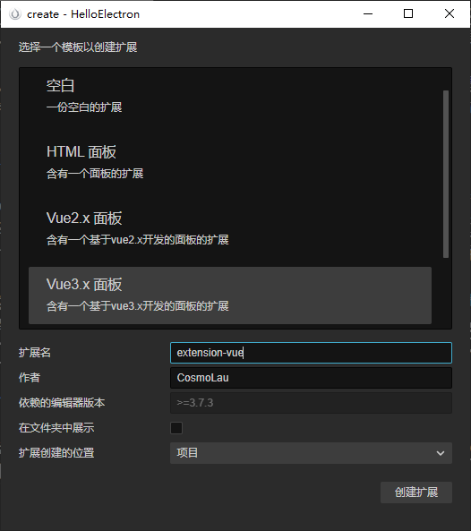

创建完成后，在项目工程的 `extensions` 文件夹中会生成这么一个目录结构：

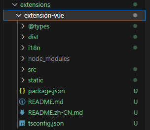

目录结构的详细解释，在 [目录结构](https://docs.cocos.com/creator/manual/zh/editor/extension/first.html#%E6%89%A9%E5%B1%95%E7%9B%AE%E5%BD%95) 中有记载，包括 `package.json` 的字段含义，也在同一篇文档中。

此时已经创建好了一个扩展模板，需要按照 `README.zh-CN.md` 中的方法来安装 **npm 依赖**。

> *注意*：使用 npm 需要安装 [Nodejs](https://nodejs.org/en) 环境，如果你还没有安装，推荐 Windows 开发者安装 [NVM for Windows](https://github.com/coreybutler/nvm-windows) 方便进行 Nodejs 的版本管理。（~~总有一天会需要用到切换版本的功能~~）

安装 **npm 依赖** 需要打开终端来执行命令，如果你对终端的用法不了解，可以在 VSCode 中使用快捷键 <kbd>Ctrl</kbd> + <kbd>Shift</kbd> + <kbd>`</kbd> 来打开，然后以此执行以下命令：

```bash
# 切换到扩展目录下
cd .\extensions\extension-vue\
# 安装 npm 依赖
npm install
```

然后我们回到 Cocos Creator 编辑器，在 `扩展` -> `扩展管理器` -> `已安装扩展` 中启用创建好的扩展。

> *提示*：在开发插件的过程中如果遇到数据没刷新之类的问题，可以使用此方法来重新关闭开启插件，以重新加载插件。

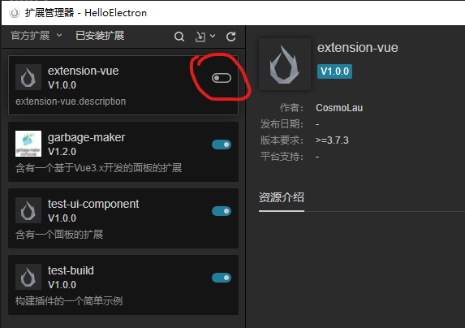

接着就能通过 `面板` -> `extension-vue` -> `默认面板` 打开扩展模板面板，此时已经完成了扩展的创建。

## 使用 UI 组件布局

面板布局主要在 `extension-vue/static/template/default/index.html` 中进行修改，下面统一用 **index.html** 来代指。

如果需要添加 CSS 样式，可以在 `extension-vue/static/style/default/index.css` 中进行添加，下面统一用 **index.css** 来代指。

我们根据 [UI 组件](https://docs.cocos.com/creator/manual/zh/editor/extension/ui.html) 文档的步骤，通过 `开发者` -> `UI 组件` 来打开 **UI 组件面板**，这个面板里的参考代码很重要（也有很多坑），我们整个开发过程中都会用到，可以一直开着这个面板。

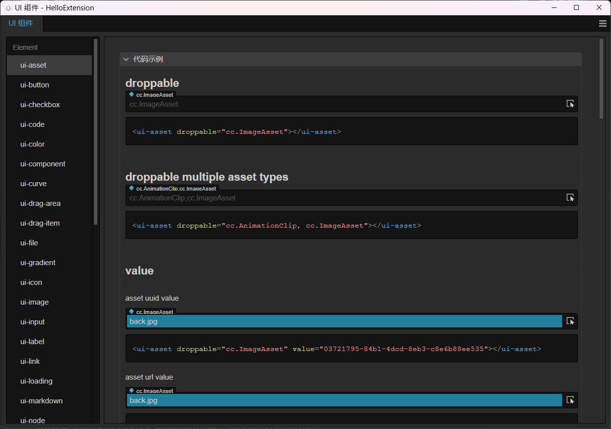

我们回到 **index.html** 中，我们先将 `<my-counter></my-counter>` 和 `<h1 id="text"></h1>` 注释掉，接下来要添加的所有 UI 组件标签都需要写在 `<div id="app"></div>` 标签内。

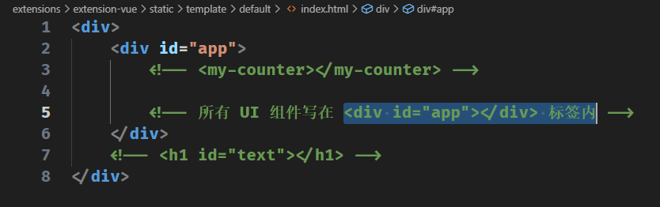

接下来我们尝试用 UI 组件拼出一个界面来。

### 使用 ui-prop 组件

ui-prop 组件能让可视化界面有一个整洁的排版，是很适合用来设置布局的组件。

我们先来看一下 UI 组件面板中的 `layout` -> `ui-prop` 组件示例：

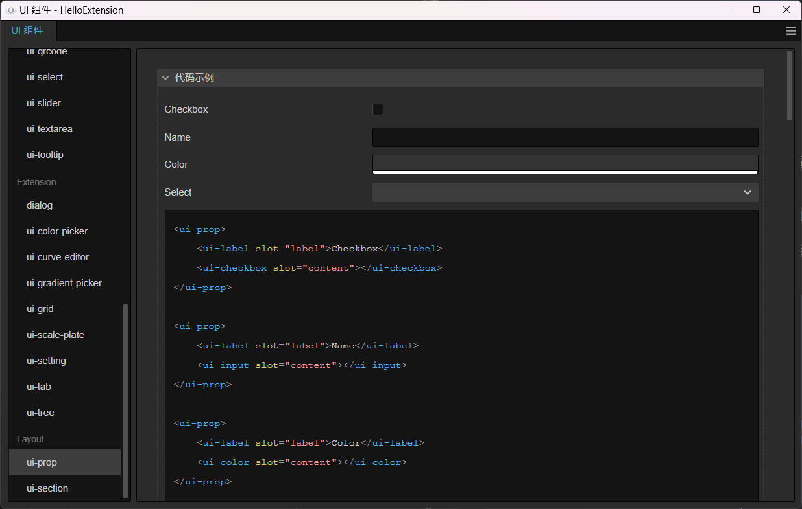

先将第一个示例添加到 **index.html** 的 app 标签中，并且添加一个 `<h1></h1>` 标签来作为面板的标题。

```html
<div>
    <div id="app">
        <!-- 所有 UI 组件写在 <div id="app"></div> 标签内 -->

        <h1>Extension Vue</h1>

        <ui-prop>
            <ui-label slot="label">Checkbox</ui-label>
            <ui-checkbox slot="content"></ui-checkbox>
        </ui-prop>
        
        <ui-prop>
            <ui-label slot="label">Name</ui-label>
            <ui-input slot="content"></ui-input>
        </ui-prop>
        
        <ui-prop>
            <ui-label slot="label">Color</ui-label>
            <ui-color slot="content"></ui-color>
        </ui-prop>
        
        <ui-prop>
            <ui-label slot="label">Select</ui-label>
            <ui-select slot="content">
                <option value="1">Lorem ipsum dolor sit amet consectetur, adipisicing elit. Sit, sint.</option>
                <option value="2">Sapiente ratione esse voluptatibus repudiandae illo numquam quas nulla id.</option>
            </ui-select>
        </ui-prop>

    </div>
</div>
```

然后我们通过 `面板` -> `extension-vue` -> `默认面板` 来查看面板效果：

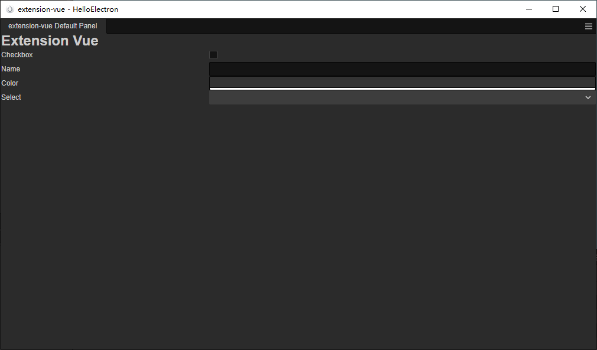

这样看起来不太美观，标题可以居中显示，而且 `ui-prop` 之间得加点间距。

3.x 版本的 UI 组件没有 2.x 的 `ui-box-container` 组件来框柱 `ui-prop`，看起来也不太好看，来看看 2.x 的效果：

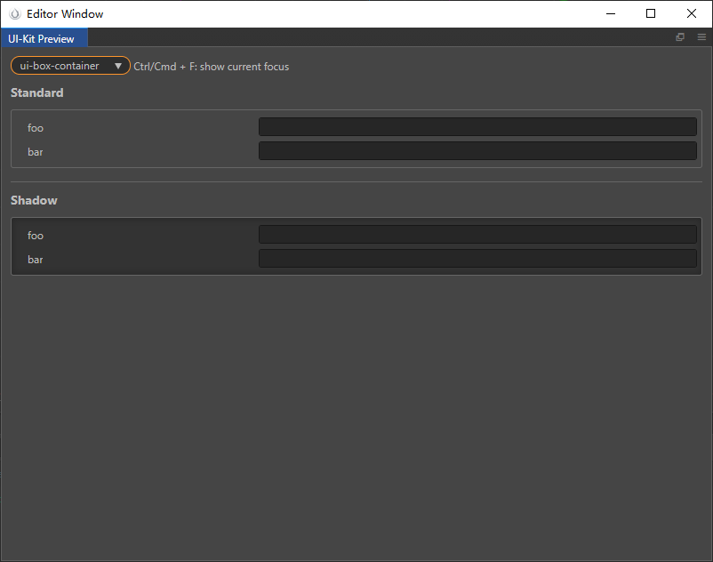

既然 3.x 没有，那我们就用 CSS 来实现一个，在 **index.css** 中添加以下样式：

```css
/* index.css */
h1 {
    /* 文本居中 */
    text-align: center;
}
.box {
    /* 外边距 10px */
    margin: 10px;
    /* 内边距 5px */
    padding: 5px;
    /* 虚线边框 */
    border-style: dashed;
    /* 边框宽度 1px */
    border-width: 1px;
    /* 边框颜色为灰色 */
    border-color: gray;
}
ui-prop {
    /* 添加上边距 5px */
    margin-top: 5px;
}
```

然后我们将所有 `ui-prop` 组件添加到一对 `<div></div>` 标签中，并为 div 添加 css 中定义的 box 样式。

```html
<!-- index.html -->
<div>
    <div id="app">

        <!-- 所有 UI 组件写在 <div id="app"></div> 标签内 -->

        <h1>Extension Vue</h1>

        <div class="box">
            <ui-prop>
                <ui-label slot="label">Checkbox</ui-label>
                <ui-checkbox slot="content"></ui-checkbox>
            </ui-prop>
            
            <ui-prop>
                <ui-label slot="label">Name</ui-label>
                <ui-input slot="content"></ui-input>
            </ui-prop>
            
            <ui-prop>
                <ui-label slot="label">Color</ui-label>
                <ui-color slot="content"></ui-color>
            </ui-prop>
            
            <ui-prop>
                <ui-label slot="label">Select</ui-label>
                <ui-select slot="content">
                    <option value="1">Lorem ipsum dolor sit amet consectetur, adipisicing elit. Sit, sint.</option>
                    <option value="2">Sapiente ratione esse voluptatibus repudiandae illo numquam quas nulla id.</option>
                </ui-select>
            </ui-prop>
        </div>

    </div>
</div>
```

这样，我们的面板就变得整洁了起来：

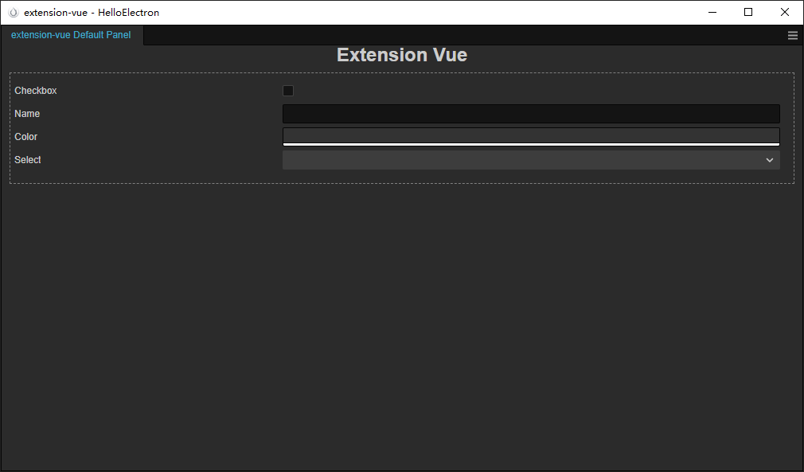

> *注意*：编写好 html 后，需要关闭面板重新打开才能看到修改后的内容。

使用 `ui-prop` 时需要注意 slot 的用法，`slot="label"` 的组件会放到 `ui-prop` 左边的显示区域，`slot="content"` 则是显示在右边的显示区域，如果在 `ui-prop` 标签对中添加元素而不使用 `slot` 属性的话，就会被另起一行显示。

如果我们想在 Checkbox 的 `ui-prop` 中再添加一个 `ui-checkbox` 元素，且不添加 `slot` 属性的话，就会变成如下的效果：

```html
<!-- index.html -->
...
<ui-prop>
    <ui-label slot="label">Checkbox</ui-label>
    <ui-checkbox slot="content"></ui-checkbox>
    <ui-checkbox></ui-checkbox>
</ui-prop>
...
```

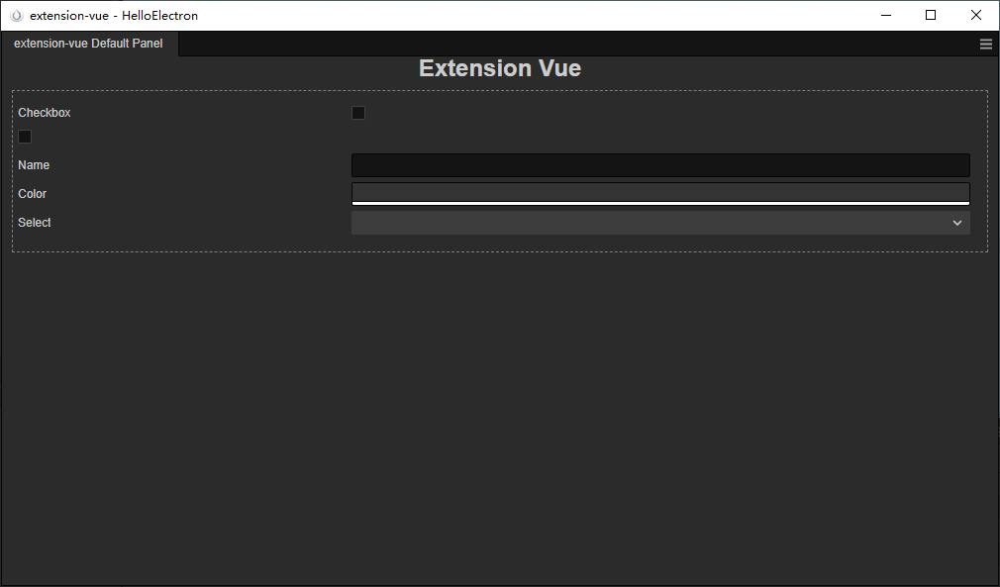

所以正确的做法应该是：

```html
<!-- index.html -->
...
<ui-prop>
    <ui-label slot="label">Checkbox</ui-label>
    <ui-checkbox slot="content"></ui-checkbox>
    <ui-checkbox slot="content"></ui-checkbox>
</ui-prop>
...
```

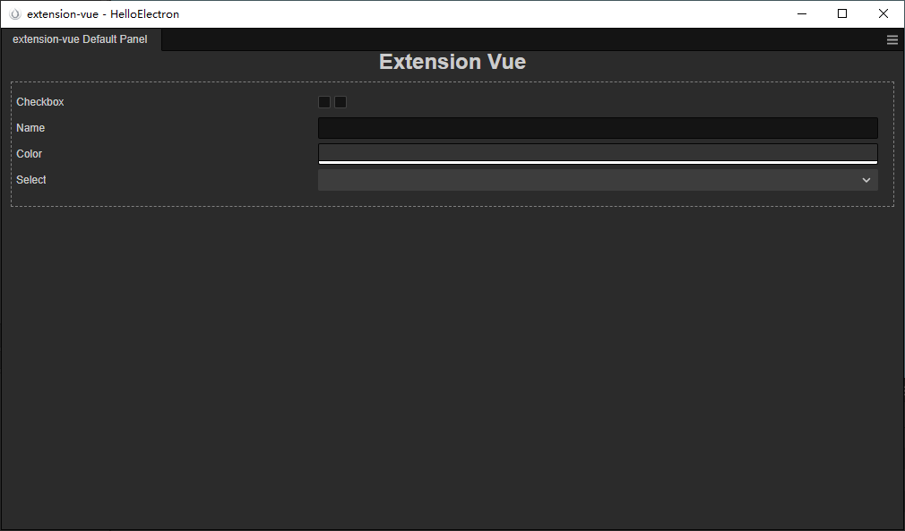

> *吐槽*：UI 组件面板中的示例代码很好，但是详细解释太少了，要么就应该像 2.x 一样在官方文档中详细写出每个属性的用法。

至此，我们已经尝试使用 UI 组件、HTML 原生标签、CSS 样式来完成基本的面板布局，接下来就可以靠搭积木的方式打造自己的扩展面板了。

如果对 HTML 和 CSS 不熟悉，或者已经忘得差不多了，可以到 [W3school 官网](https://www.w3school.com.cn/) 找你想要的内容。

## 使用 Vue3 的特性

我们来做一个根据扩展名来统计文件数量的扩展。

### 编写逻辑代码

先打开 `extension-vue/src/panels/default/index.ts`，这是面板的入口文件。

在模板代码中，我们主要修改 `ready` 函数中的内容，`ready` 函数是面板启动后触发的钩子函数。

在 `ready` 函数体中，有如下的代码：

```typescript
import { createApp } from 'vue';
// ...
module.exports = Editor.Panel.define({
    $: {
        app: '#app',
    },
    ready() {
        const app = createApp({});
        app.mount(this.$.app);
    }
})
```

这段代码的意思就是创建一个 **Vue App** 挂载到 `#app` 标签上，就是为什么我们在 `index.html` 中需要把布局写到 `<div id="app"></div>` 标签对中的原因。

在这篇演示中，我们的逻辑代码主要写在 `createApp({})` 中。

首先我们定义两个数据，用于存放每个扩展名对应的文件数量和文件的总数量：

```typescript
createApp({
    data() {
        return {
            /** 扩展名对应的文件数量 */
            fileCount: {},
            /** 文件总数量 */
            fileNum: 0
        }
    }
})
```

接着我们来写主要的逻辑，将写在 `methods: {}` 中，`data` 中定义的数据我们可以通过 `this.xxx` 取到。

```typescript
import { readdirSync, readFileSync, statSync } from 'fs-extra';
import { extname, join } from 'path';
// ...
createApp({
    data() {
        return {
            /** 扩展名对应的文件数量 */
            fileCount: {},
            /** 文件总数量 */
            fileNum: 0
        }
    },
    methods: {
        checkAssets() {
            // 定义两个数据的临时变量
            let fileCount: {[key: string]: number} = {};
            let fileNum = 0;
            // 获取 assets 文件夹的路径
            let assetsPath = join(Editor.Project.path, "assets");
            let checkDir = (dirPath: string) => {
                // 获取文件夹下所有的文件名
                let files = readdirSync(dirPath);
                // 遍历文件名
                files.forEach((fileName) => {
                    // 当前文件的路径
                    let subPath = join(dirPath, fileName);
                    // 文件的信息
                    let stat = statSync(subPath);

                    if (stat.isDirectory()) {
                        // 如果文件是个目录，递归查找
                        checkDir(subPath);
                    }
                    else if (stat.isFile()) {
                        // 获取文件的扩展名
                        let extName = extname(fileName);
                        if (extName != "" && !fileCount[extName]) {
                            fileCount[extName] = 1;
                        }
                        else if (extName != "" && fileCount[extName]) {
                            fileCount[extName] += 1;
                        }
                        else {
                            if (fileCount["other"]) {
                                fileCount["other"] += 1;
                            }
                            else {
                                fileCount["other"] = 1;
                            }
                        }
                        fileNum++;
                    }
                })
            }

            checkDir(assetsPath);
            // 将临时变量赋值给 data 中定义的变量
            this.fileCount = fileCount;
            this.fileNum = fileNum;
        }
    }
})
```

代码中我们用到了 `Editor.Project.path` 接口，用来获取项目目录路径，可以查看 [Editor API 说明](https://docs.cocos.com/creator/manual/zh/editor/extension/editor-api.html) 文档来查询需要的功能。

我们这段逻辑需要在面板打开时就执行，所以我们需要用到 [生命周期钩子](https://cn.vuejs.org/guide/essentials/lifecycle.html) 中的 `beforeMount` 生命周期：

```typescript
// ...
createApp({
    data() {
        return {
            /** 扩展名对应的文件数量 */
            fileCount: {},
            /** 文件总数量 */
            fileNum: 0
        }
    },
    methods: {
        checkAssets() {
            // ...
        }
    },
    // 挂载应用之前
    beforeMount() {
        this.checkAssets();
    }
})
```

这样，我们的逻辑代码就写好了。

> *重要*：TS 代码需要通过 tsc 命令编译成 JS 代码才能在扩展中生效，可以在终端中执行命令 `npm run build`，来编译 TS 脚本，或者执行 `npm run watch` 来监听 TS 脚本的变化，自动编译。

### 使用 Vue3 来布局

我们要对 `index.html` 进行重新布局，先删除掉之前的 UI 组件示例代码，我们重新编写一套：

```html
<!-- index.html -->
<div>
    <div id="app">

        <h1>Extension Vue</h1>

        <div class="box">

            <ui-prop v-for="(value, key) in fileCount">
                <ui-label slot="label">{{ key }}</ui-label>
                <ui-input 
                    slot="content" 
                    readonly
                    :value="value"
                >
                    <span slot="suffix">个文件</span>
                </ui-input>
            </ui-prop>

            <ui-prop>
                <ui-label slot="label">总计</ui-label>
                <ui-input 
                    slot="content" 
                    readonly
                    :value="fileNum"
                >
                    <span slot="suffix">个文件</span>
                </ui-input>
            </ui-prop>

        </div>

    </div>
</div>
```

这里我们用到了 [列表渲染](https://cn.vuejs.org/guide/essentials/list.html) 中的 `v-for` 来显示出所有扩展名对应的文件数量。

`:value` 是 `v-bind:value` 的简写，详情可参考 [Attribute 绑定](https://cn.vuejs.org/guide/essentials/template-syntax.html#attribute-bindings)，通过这个方法，我们将 `data` 中定义的两个值绑定到 `ui-input` 标签的 `value` 属性上。

这样，我们基本算是完成了这个插件的主要功能，让我们通过 `面板` -> `extension-vue` -> `默认面板` 打开面板看看效果吧：

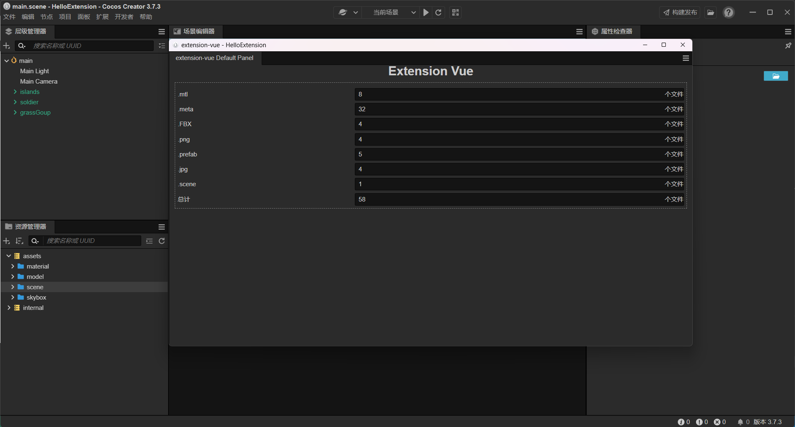

看来 Cocos Creator 3.7.3 的 Hello World 模板项目的 Assets 文件夹下有 58 个文件。

### 来点交互

我们这个扩展有个问题，他只能在打开面板的时候统计文件数量，如果我们在不关闭面板的情况下增删 Assets 目录中的文件，面板上的数据就不会刷新，我们为面板加一个按钮来手动刷新数据。

```html
<!-- index.html -->
<div>
    <div id="app">

        <h1>Extension Vue</h1>

        <div class="box">
            <!-- ... -->
        </div>

        <div style="text-align: center;">
            <ui-button type="primary" @confirm="checkAssets">
                <ui-icon value="refresh"></ui-icon>
                刷新
            </ui-button>
        </div>

    </div>
</div>
```

这里我们用到了 [事件处理](https://cn.vuejs.org/guide/essentials/event-handling.html)，使用 `@confirm` 绑定了 `checkAssets` 函数，UI 组件支持的事件我们可以在 **UI 组件面板** 中查看：


其中 **Events** 就是该组件支持的事件名，示例代码也给出了 Vue 的写法。

> *吐槽*：Vue 示例代码中应该是用 `methods: {}`，不要将 Vue 示例代码原封不动的 Copy 到脚本里，会变得不幸。

在这段代码中，我们将 `ui-button` 也装进了一个 div 中，我们可以直接在标签中添加 `style` 属性更改标签的样式，但如果 `style` 内容较多，建议还是写在 `index.css` 中。

我们关闭面板，重新打开看看效果：

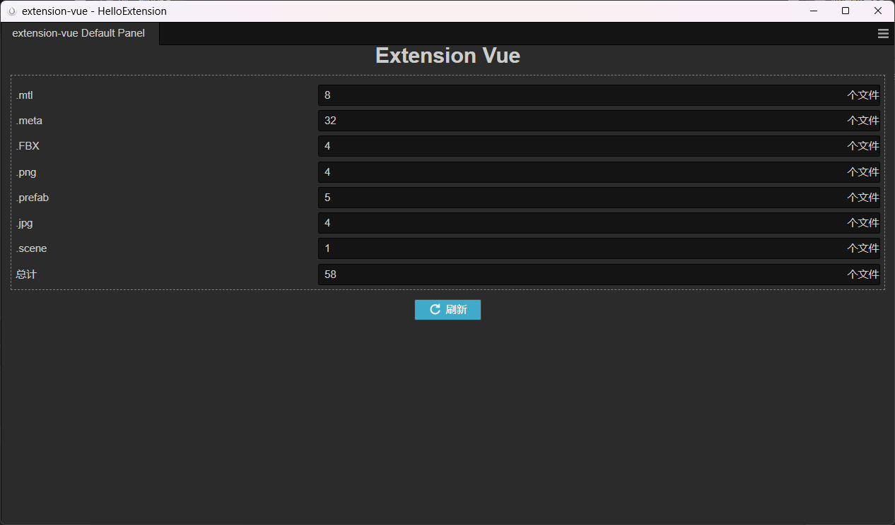

仍然是 58 个文件。（~~废话~~）

不要关闭面板，我们在编辑器的资源管理器中添加一个名为 `script` 的文件夹，并创建一个 TypeScript 脚本文件，叫 **HelloWorld**

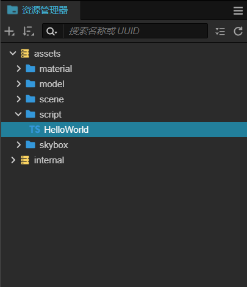

这时，我们点击 `extension-vue` 面板中的 **刷新** 按钮。

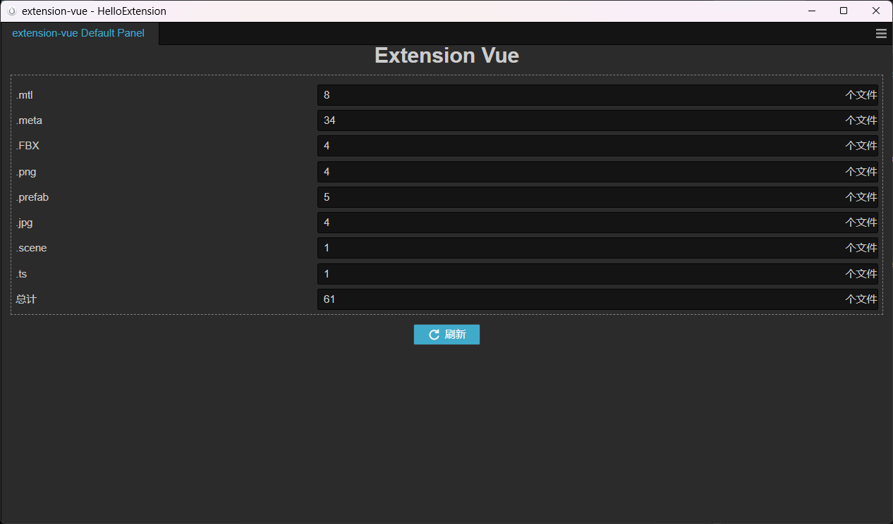

我们发现多了一个 .ts 类型文件，但是总计比之前多了 3 个，另外两个文件分别是 `script.meta` 和 `HelloWorld.ts.meta` 文件，这是编辑器自动生成的文件。

至此，你已经尝试了 `HTML`、`CSS`、`UI 组件`、`Vue3 列表渲染`、`Vue3 事件处理`、`Vue3 生命周期`、`Editor 接口调用` 等内容，相信你对 Cocos 扩展已经有了初步的了解。如果仍有疑问，请积极回帖探讨，我是个插件开发的萌新，本篇文章只是个人的经验总结，如果能让你入门插件开发，那是我的荣幸。

插件开发时，请灵活运用相关的文档：

* [扩展编辑器](https://docs.cocos.com/creator/manual/zh/editor/extension/readme.html)
* [Vue.js](https://cn.vuejs.org/)
* [W3school](https://www.w3school.com.cn/)

> *吐槽*：官方文档里是有 [多语言系统（i18n）](https://docs.cocos.com/creator/manual/zh/editor/extension/i18n.html) 文档的，但是这篇文档的入口被隐藏在了 [基础功能](https://docs.cocos.com/creator/manual/zh/editor/extension/basic.html) 页面中，侧边栏找不到这个 i18n 文档的入口，而且 **基础功能** 文档，在侧边栏是叫 **扩展功能详解**，真的迷惑……

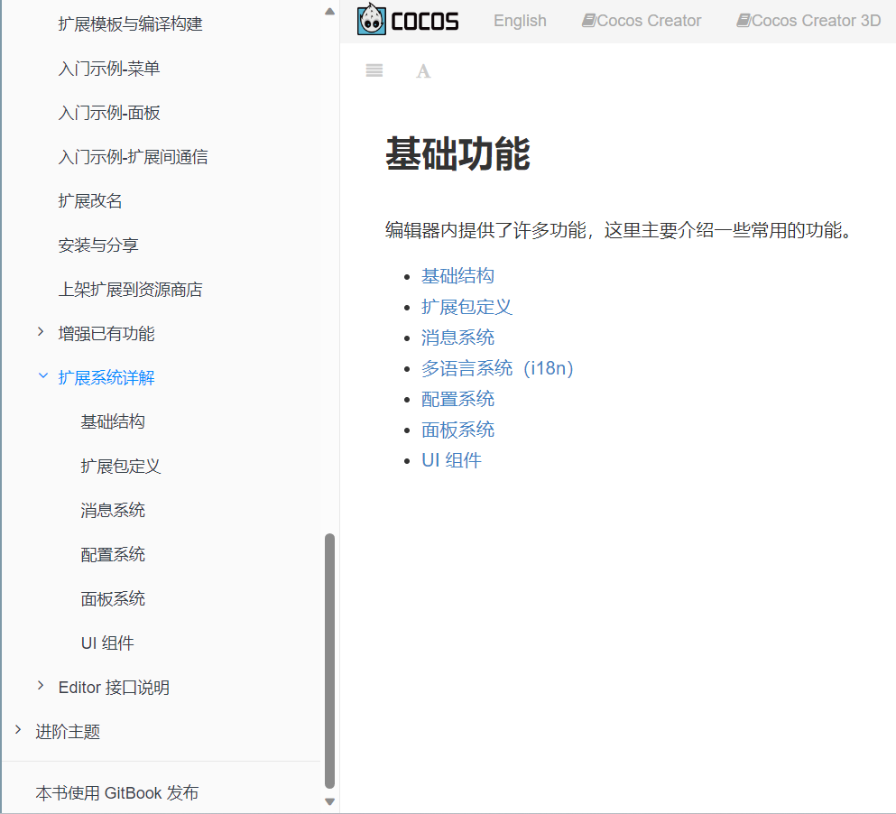

### 彩蛋

在扩展根目录中放入一个 PNG 格式的图片资源，命名为 `logo.png`，就能在扩展管理器中显示 LOGO 啦。

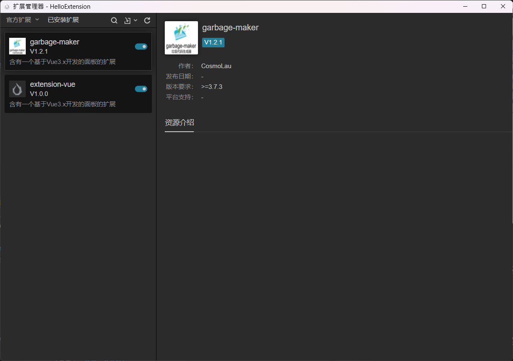

## 总结

插件开发的意义在于实现自动化，可以解放部分重复的工作，降低重复工作导致的人工犯错几率，作为程序员，就应该使用程序来帮助自己提高效率（~~这样才能更好的摸鱼~~）。

官方在插件开发的文档方面，从 2.x 开始一直都不太完善，感觉都是徒有文档，入门还是得自己摸索，希望有朝一日能有更完善的插件开发文档。

本篇内容中编写好的插件已经开源到 [GitHub 仓库](https://github.com/CosmoLau/extension-vue)，需要的话请移步仓库查看。

另外，如果本篇文章并不能让你入门插件开发，论坛中也有其他大佬写的开发指南，可以参考他们的帖子：

[[muzzik 教程]：3.x 插件开发指南](https://forum.cocos.org/t/topic/144174)
[【muzzik教程】：插件开发之道](https://forum.cocos.org/t/muzzik/99553)
[手把手教你如何使用 rollup + vue单文件 工作流开发 3.x 插件](https://forum.cocos.org/t/topic/122964)
[【插件开发】升级Vue2.x+Element-ui+组件式开发Creator2.x](https://forum.cocos.org/t/topic/149927)
