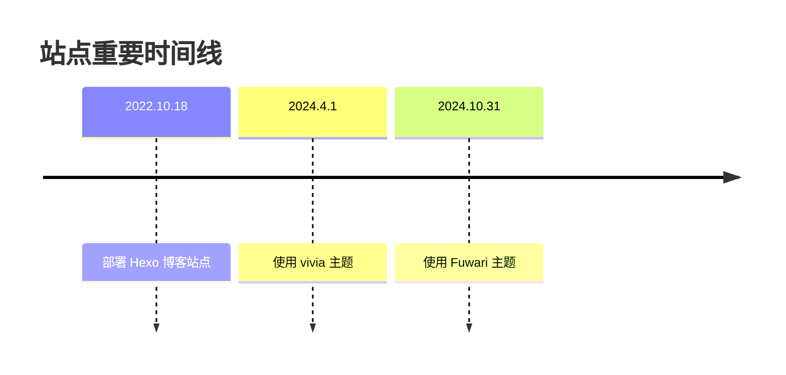

# 2024.10.31

我刚用上 vivia 作为主题不久，作者就停止了维护，转而投入到 Fuwari 的开发。由于 Fuwari 是基于 Astro 的，我又不太想换一个不熟悉的框架，而且 Fuwari 还有些问题不符合我的预期，所以迟迟没迁移。

直到这天，Fuwari 已经基本符合我的预期，我也对站点进行了一次小小的规划，将其部署到了 `blog.cosmolau.top` 这个域名上。

::github{repo="saicaca/fuwari"}

# 2024.5.20

这天我翻译的 [Husky 文档](https://typicode.github.io/husky/zh/) 终于被[合并](https://github.com/typicode/husky/pull/1413)了，起因是我想把我的 husky 分叉仓库部署到自己的域名上，结果在添加了 `CNAME` 文件后，发现 PR 也被同步修改了，此时我才发现，原来提交 PR 的流程我还是没搞懂。

::github{repo="CosmoLau/husky"}

我将构建后的文档部署到了 [www.cosmolau.top/husky/zh/](https://www.cosmolau.top/husky/zh/)，不过现在我还是建议你去看官方文档。（顺便说一下，官方文档的多语言支持也是我做的）

# 2024.4.16

将 oclif 文档翻译成了中文，并添加了多语言的支持，不过提交的 PR 并没有被采纳。

::github{repo="CosmoLau/oclif.github.io"}

既然官方没法合并 PR，那我就只能自己部署在 [www.cosmolau.top/docs/oclif/zh/](https://www.cosmolau.top/docs/oclif/zh/) 了。

# 2024.4.1

博客长期没有维护，我觉得可能是我选的主题不符合我的审美，所以到 [Hexo 官方收录的主题页](https://hexo.io/themes/) 寻找自己对的上眼的主题，最终选择了 [vivia](https://github.com/saicaca/hexo-theme-vivia)。

::github{repo="saicaca/hexo-theme-vivia"}

作为新博客的第一天，我把我发布在 Cocos 论坛的文章做为了本博客的第一篇文章，[《【从零开始的插件开发】使用 CC3.x + UI组件 + Vue3 开发一个插件》](../cocos-extension/)发布了。

# 2022.10.18

因为看见别人的 Demo 域名为 `github.io` 后缀，所以知道了 **GitHub Pages** 的存在，然后在一众静态博客框架中选择了 `Hexo`，其原因是 `Hexo` 是 JavaScript 写的。

我正好有个域名，索性就把 GitHub Pages 修改成了自定义域名 `www.cosmolau.top`。
