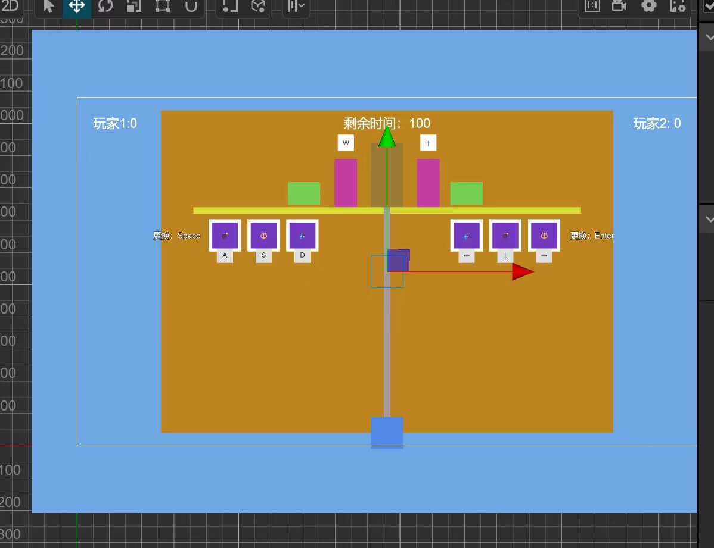
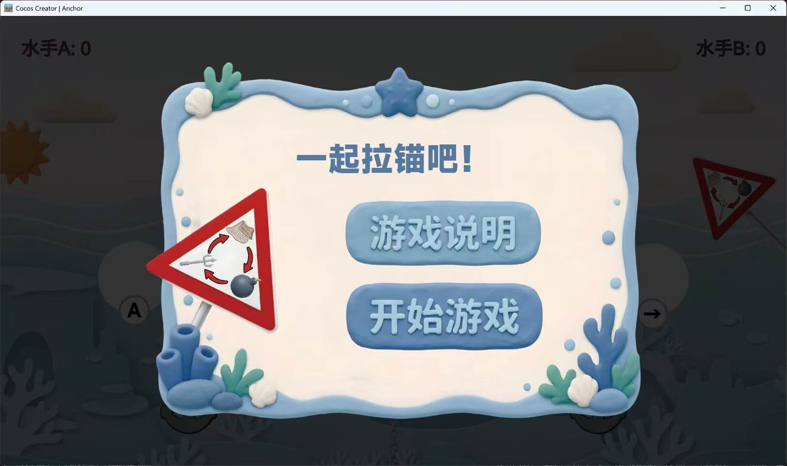
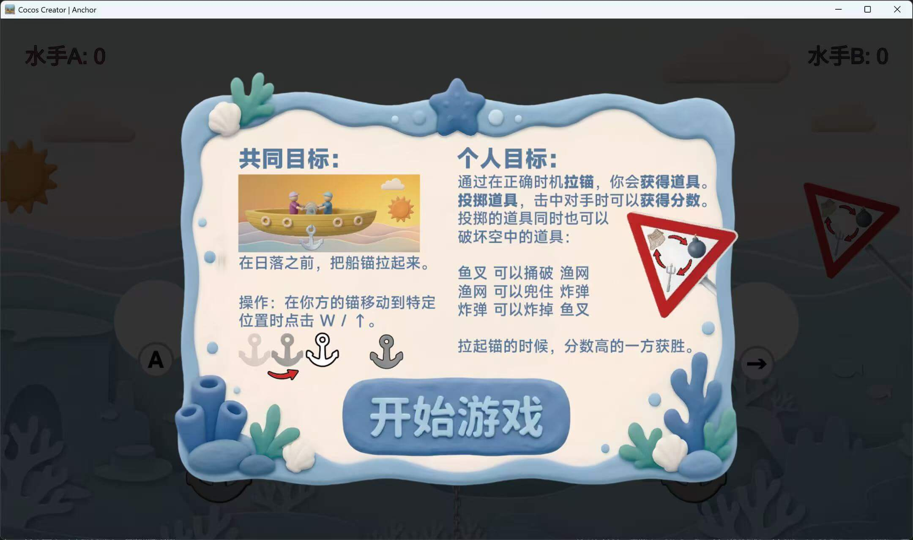
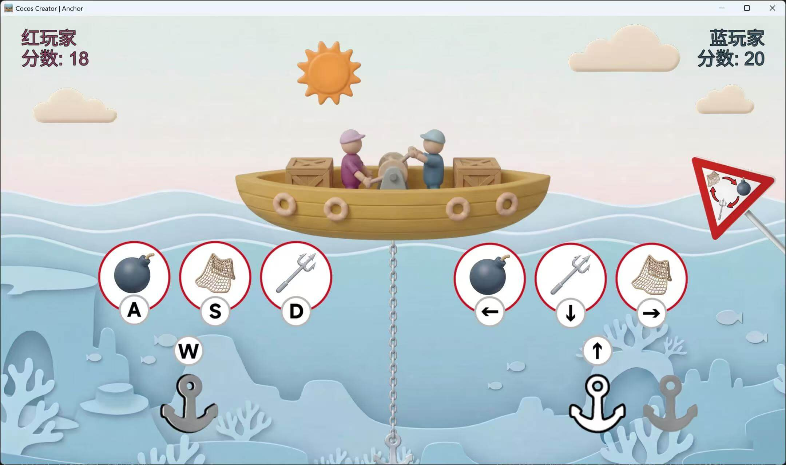
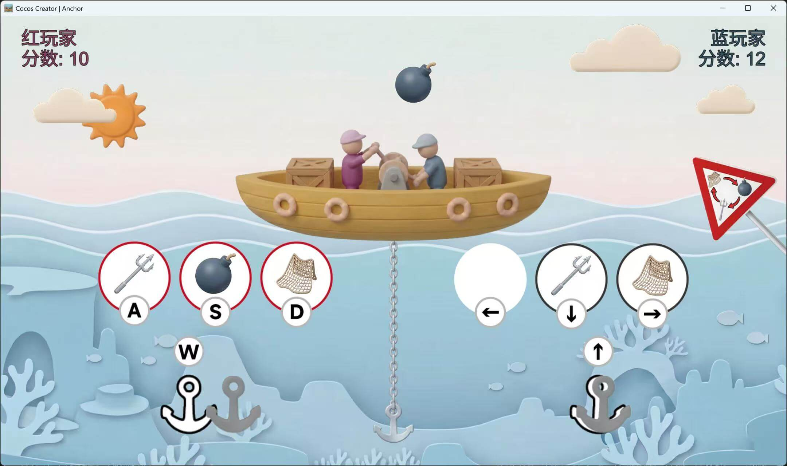
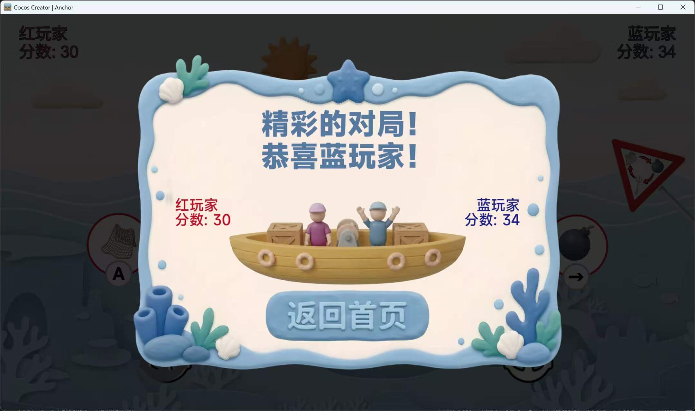

# 初尝 Vibe Coding——在 GameJam 中进行实战

2026年7月3日-5日，这是我第三次参加 GameJam 活动，这次活动是由 CiGA 举办的 2026 年第一场 GameJam，我参加了由**帕斯亚科技**主办的重庆线下比赛。

这次参赛再各种机缘巧合下，让我首次尝试了 Vibe Coding 开发一个完整的项目，感受颇深，下文会依次讲述。

## 主题公布与 GDD

这一届的 CiGA2026 赛程从2026年7月3日（周五）14:00 就开始了，15:00 正式公布了主题：`Anchor`。

由于周五还处于工作日，我只能在公司通过线上直播的方式等待主题的公布。当主题 `Anchor` 公布的第一时间，我相信对于大多数程序来说，这个词并不陌生，它是在游戏引擎编辑器中会频繁使用的单词——“锚点”，然后紧接着当然是让大模型解释一下 Anchor 有没有其他含义，发现对于我来说，只能将“锚”作为方向来思考:spoiler[后来发现，大家都没逃出“锚”的束缚]。

由于我擅长使用的是 Cocos Creator 3.8 做 2D 游戏开发，然后就将自身的技术栈和擅长领域扔给 AI，开始与 AI 进行头脑风暴。为什么跟 AI 进行头脑风暴？那是因为我此时还在公司，没法参与线下的组队，为了防止到时候组不上队，被迫 SOLO 开发，就得自己先想个方案以备不时之需。

### 与 AI 的头脑风暴

我一开始是使用 DeepSeek 的 Web Chat 来进行头脑风暴的，我让它帮我发散一下这个主题，并简单讲了下自己擅长的领域后，给了我一些建议，但是大多数我都没采纳，不给讨论还是给了我很多启发，也就两轮对话，我就决定好了核心玩法：

```text
目前的想法是做一个双人合作对抗游戏，两个人同时拉锚，必须要交替拉动才能把锚拉起一定距离，如果间隔太短或太长，会导致锚落下，成功拉起各自获得积分，限定时间内完成，如果没完成，两者都失败，如果完成了，再对比积分，然后每个玩家会同时生成三个道具，这三个道具本质是剪刀石头布，用来相互攻击和化解的，但是需要换一种表现形式，当所有玩家的道具使用完之后，过一段时间再会同时生成三个道具，这个生成道具的表现可以表现为飞来一个箱子，从中获得三个道具，这三个道具必定是不一样的，但是按键位置随机，随意每次都要考验玩家的反应，帮我细化一下这个方案
```

从上面这句话开始，我和 DeepSeek 不断完善这个想法，AI 非常聪明，一开始就给了个看着不错的完整方案，我又通过数轮的对话不断按照自己的想法对 AI 的内容进行修改，也时不时让它帮我完善我暂时还没想好的部分。

最后我觉得讨论得差不多，方案相对完善后，让 DeepSeek 讲讨论的内容整理成一个完整的文档，这应该就算是 GDD（Game Design Document）的初稿了。

### 前往会场

下班打完卡后，马不停蹄的赶往活动的线下会场，想着能不能赶上趟，捞一捞落单的大佬组个队。

结果可想而知，大部分到达会场的开发者们都组好了队，还有一部分决定 SOLO 的开发者，也已经就位，我在活动处签到后，随便找了个位置坐下来，开始梳理 DeepSeek 给我的初版 GDD，并且开始用 Cocos Creator 搭建一个原型 DEMO 场景。由于现场的网络非常不给力，我携带的笔记本电脑里很多软件都需要更新，让我草草收场，提早回家备战第二日。

不过在临走的时候有个小插曲，机缘巧合下结识了一位准备做桌游的 SOLO 开发者，我就问了下他会不会做美术，得知他有办法解决后，我就说第二天再细谈，便离开了会场。

## 尝试 AI 工作流

回到家，更新好各种软件后，没有直接睡，而是趁热打铁继续我的计划。其实一开始并没有想着用 AI 来完成这次 GameJam，依旧想使用古法编程的方式来完赛，不过近期有接触 Trae Work 来尝试一些 AI 工作流，所以也顺着思维惯性想用 Trae Work 尝试来实现这个玩法。当时也是正巧看到已经有开发者通过 AI 生成了一个 H5 的原型 DEMO，并发到了比赛群里，不过这个 DEMO 我并没有运行起来，但这也给了我一个启发，我直接讲 DeepSeek 生成的 GDD 文本复制下来扔进 Trae Work 中，让 Trae 给我生成一个这个样的 H5 游戏，也是没让我失望，还真就做出来了，并且可玩，就是给了我很大的信心，觉得说不定靠它就能搞定，倒头就睡了。

第二天一早就赶到会场，本来想讲 Cocos 工程目录添加到 Trae Work 中来继续开发，但是 Cocos 目前并没有官方的 MCP（有第三方的，但是使用过一次，效果不太理想），所以游戏的基础框架还是靠古法编程来实现。

古法编程持续没多久，我就有点受不了了，准备换个工具，用上了发布不久的 MimoCode 来帮助我完成项目，正好我上个月白嫖的 Mimo Token Plan 还能继续用，38B 的 credits 应该没有压力，就用在 Trae（不是 Trae Work）中开了个集成终端来运行 MimoCode，然后接入 Token Plan，用 MimoCode 的 Build 模式来进行开发。

### Vibe Coding

我用古法编程做了个开头，然后把 DeepSeek 生成的方案命名为 `GDD.md` 放入 Cocos 项目根目录中，再按照惯例添加了一个 `AGENT.md` 来设置一些简单的约束，想着是后续 Vibe Coding 过程中，遇到 AI 频繁犯错的问题，就写进这里。接着就开始让 Mimo 阅读我的 GDD，并给我搭建一个游戏框架，帮我列举一些需要编写哪些模块，这里我要求 Mimo 不要修改代码，而是先让我看一下它的想法，其实后续看来，当时应该用 Plan 模式来讨论框架设计，应该会更方便一些。

MimoCode 给我的框架还不错，但并不是所有内容我都能接受，所以为了让整个 Vibe Coding 一直可控，我会一个一个模块来实现，先创建这个模块的文件，然后让 MimoCode 尝试在文件中生成我想要的功能，我再对功能进行审核和测试（因为没有 MCP，测试还得我自己来），如果没问题，就提交 Git 并继续下一个模块。

基本上整个第二天我都在给 MimoCode 发号施令，绝大部分的时候我都在等待它编写代码，我几乎只写几行代码用于开个头，甚至连修复 BUG 和修改数值配置我也只让 MimoCode 自己分析自己修复，我只负责审核。就这样持续到下午快到饭点的时候，我觉得我的原型完成得差不多了，核心玩法全部跑通，如果不在意屏幕上的单色色块的话，完全能做到可玩的程度了，心中大喜。

### 游戏原型

这里展示一下当时的原型，顺便简单介绍一下此时的玩法。



* 合作拉锚：
  两个玩家需要分别使用 <kbd>W</kbd> 和 <kbd>↑</kbd> 键来将中间的船锚拉到船上，才能获得成功。合作的关键在于，两个玩家需要按照节奏交替按下按钮，才能让船锚上升，否则船锚会下降。  
  > 设计点参考了 *《节奏医生》* 中双人举杠铃的玩法，目的是让两个玩家进行配合。

* 干扰对抗：
  船锚被拉起一定高度后，每个玩家都会随机顺序获得三个道具（对应剪刀石头布），玩家可以按键来扔出道具，道具会从自身玩家经过抛物线飞向另一个玩家，在道具飞行期间，被攻击玩家可以扔出道具进行反制，如果道具克制，会消除对方的道具，自己的道具继续飞行直到对玩家造成伤害（表现为分数减少）；反之如果自己被克制，自己的道具就会消失，导致自己面临受到伤害。如果道具相同，就会相互抵消。只有在自己扔出的道具消失后才能继续扔出，如果道具耗尽后，会自动重新生成三个，也可以手动装填，但是会有装填硬直（即等待一定时间才能刷新道具）。
  > 对抗的设计是在基础的猜拳上做了很多扩展，玩家需要做好道具管理，并且在合适的时机进行道具出招，这里有个我觉得歪打正着的设计，就是如果两个玩家的操作都能克制对方，就可以达到一种打羽毛球时相互击球的效果。

* 结束判定
  时间耗尽，两位玩家都失败；时间耗尽前船锚被拉起，分数高的玩家获胜，相同则平局。
  所以在设计上鼓励玩家以合作为主要，干扰对方为次要。

### AI 生图

我因为对 Vibe Coding 出来的项目还挺满意，但是因其是一个合作且对抗的多人游戏，我单人玩下来并不能获得真实的反馈，我就找了前一天结识的桌游 SOLO 开发者**狗蛋**来跟我一起尝试一下。

意料之中，我和狗蛋尝试了一把就发现了很多问题：

* 拉锚原本是想通过音乐来提供节奏，但是因为没有音频，完全不知道什么时候时候拉锚，这里狗蛋提出添加视觉效果来代替音效。
* 对抗道具因为会无限生成，会让人不去拉锚而专注对抗，这里狗蛋提出可以通过成功拉锚来获得道具。
* 两个玩家的分数展示没有太大的视觉变现力，狗蛋建议改成血条，但是这里被我否决了，我认为血条不太好融入这个主题，就没有改。*后面收到其他开发者的游玩反馈，觉得确实还是该加一个类似血条的视觉表现，可以不做成血条，而做成其他形式。*

以上，我这边主要对“合作”和“对抗”这两个核心玩法进行改进，然后狗蛋在看完项目后，便找我要了上面的原型图，准备让 AI 来生成游戏的素材，导入游戏中。

一直忙到晚上，第一版的素材替换还是让人满意的，终于有个人样了，这里直接放游戏的成品展示图：











## 收尾

这里非常感谢狗蛋，几乎帮忙准备了所有游戏中需要使用的资产，包括图片、音频、音效等，还对游戏的 UI 布局提供了非常多的建议。

由于第二天忙到很晚，我没有回家，直接在会场的沙发上睡了，最后一天的早上很早就醒了，买了俩包子吃完后，准备对游戏进行最后的收尾工作。

### 给 AI 擦屁股

这收尾工作其实非常艰难，在 Vibe Coding 的时候反而是最轻松的。因为游戏原型做得非常潦草，在导入各种资产的时候，需要在 Cocos Creator 编辑器中修改节点关系，导致耦合的代码也需要做出修改，这部分没办法交给 AI 来做，因为它不知道节点的关系（我不太清楚 MimoCode 能不能看懂 `.meta` 文件），为此，我必须硬啃 AI 在项目里到处拉的💩。

这个擦屁股的工作几乎持续到了临近提交作品的时候，最后有几个跟节点无关的 BUG，是关于代码逻辑的，我就还是采取指挥 AI 的方式来进行审查修改，还算是把大部分问题都解决了。

### 项目提交

GameJam 的项目收尾还挺繁琐的需要完成：

* 路演登记
  + 填写团队信息
  + 提交游戏文件
  + 准备 PPT
* GmHub 提交
  + 组队
  + 作品资料填写
  + 准备游戏文件的网盘链接

由于我和狗蛋算是临时组队，队名作品名全部没有想过，后面都是临时想了一些，随便取的名。像 PPT 和作品资料这些更是直接交给 AI 来生成和总结了。

这里在打包游戏的时候遇到个小插曲，由于 Cocos 本身对 Windows 平台打包的支持非常不好，所以我采用的是我一贯的打包成 `web-mobile` 后套壳 `Electron` 的方法，但是这里遇到个问题，Electron 的 npm 命令一直失败，挂梯子也没成功，狗蛋是香港人，说他的热点自带梯子，我连上后还真打包成功了，感谢狗蛋！

## 试玩与路演

7月5日下午14:00结束开发后，紧接着就是试玩展示环节，由于我们的游戏是双人游玩的，所以我就在自己的位置上给前来试玩的开发者们简单介绍，并且陪同游玩。

经过好几轮的试玩后，收到了开发者们的宝贵意见，主要有以下几点：

* 难度偏大，无法顾及合作和对抗
* 对抗过程视觉引导较弱，无法直观看到对抗的结果
* 没有难度曲线，可以在开始时拉远玩家的距离，提供较长的反应时间，然后再不断缩短距离

这几个问题大部分确实是有预见的，但是也没找到好的方法去解决，而难度曲线确实是我们没有考虑到的，这几个问题就带到下一次的 GameJam，再好好想想解决方案吧。

关于路演，我觉得我讲得太匆忙了，只把游戏的整体流程讲了一遍，讲完下台后才想起，游戏中的一些设计上的细节一个都没有讲，比如合作的拉锚判定是有完美判定的，对抗扔道具的设计也有一些小巧思，都没能细讲，还是上台没做好准备导致的，下次做路演的时候可以简单写个备忘，罗列一下哪些设计需要重点讲一下的。

## 结语

CiGA2026重庆站是我参加的第三个 GameJam 活动，经历第一次的草草收尾、第二次“未完待续”，这一次总算做出了一款完成度还不错的游戏。

当然，这次参与 GameJam 的方式也与以往不同，这次主要为了验证未曾尝试的 AI 工作流，以赛代练，采用了全程 AI 参与的方式，与 AI 进行头脑风暴、Vibe Coding 整个工程项目、AI 游戏资产生成、游戏资料总结与路演 PPT 生成，让我这个一直进行古法编程的程序员正式完成了一次与新时代的接轨，真的受益匪浅，希望这篇博客文章能启发我之后的项目开发，如果恰好也能给有缘翻到这篇博客的你一点帮助，那也算是我的荣幸了！
