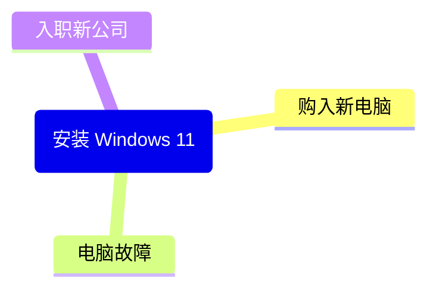

安装系统应该算是一个不太频繁，但又很必要的操作，恰恰就是其频率不高，导致每次遇到的时候总会忘记一些之前踩过的坑，所以便有了本章作为一个踩坑备忘录。

# 情景

试想一下，一般需要安装 **Windows 11** 系统是在哪些情况下？就我个人而言，应该有以下几种情况：



其实主要就是 `新装系统` 和 `重装系统` 两种情况，两者的区别不大，但是 `重装系统` 可能多一些坑，我在下文会提到。

# 备忘

> 这部分我会按照先后顺序来记录。

## 事前准备

如果是 `购入新电脑` 的情况，对于 `笔记本电脑` 来说，一般来说不太需要什么准备，电脑生产厂商应该会给你预装 Windows 11 系统。唯一需要注意的就是从开箱到开机的全程录屏，需要确保是首次激活，以免遇到 `“二手电脑”`。如何判断是不是首次激活，可以善用搜索引擎或者到各大视频平台搜索相关视频。

如果是 `入职新公司`，那情况就各种各样了，有可能老板给你配了个新电脑，也有可能给你上个离职员工用过的设备，如果是新购置的笔记本电脑，同上。如果是上个员工用过的电脑，你可能需要重装，这种情况最简单的办法就是去微软官网下载一个 `ISO` 系统镜像来安装，或者直接在 Windows 设置里重置电脑，简单快捷，无需多言。

那么，当你遇到 `电脑故障` 或者 `新买的台式机`，那你可能需要先做一个 PE 系统盘来辅助安装，我一般使用 [WEPE](https://www.wepe.com.cn/) 来制作 PE 系统盘，这需要先准备一个 U 盘，然后找个能用的电脑来制作，PE 系统盘是让你在没有安装系统时，通过 U 盘来启动一个非常小的系统，方便来安装新的 Windows 系统，也就是说，这个 U 盘制作完成后，同样也需要一份 `ISO` 系统镜像放入 U 盘里才能安装。

:::tip
如果你像我一样很久以前就有一个 PE 系统盘，那么你可能需要重新制作一个新的 PE 系统，因为以前的 PE 系统不一定能打开 Windows 11 安装镜像。
:::

## 安装引导

到成功安装系统，或是在启动新购入的笔记本电脑时，会进入到 Windows 11 的安装引导中，如果在联网情况下，引导应该会让你登录微软账号来作为 Windows 用户，但可能对一部分人来说，微软账号的昵称是中文的（可能用的真实姓名，比如我），这会导致用户文件夹也是中文，对某些软件来说，中文文件夹会导致无法读取（大概是软件使用的编码格式导致的）。所以，要么断网使用本地用户，要么就进入系统之后重新创建一个用户。

## 修改用户名

如果你没法在安装引导使用本地用户登录，那么我这里有一个方便快捷的修改用户名方法，不需要修改注册表。

首先在 `设置` -> `账户` -> `添加账户` 中新增一个账户，在弹窗中选择 `我没有这个人的登录信息`，后面再选择 `添加一个没有 Microsoft 帐户的用户`，这样就能创建一个本地用户了。添加完成后，记得给本地用户设置为管理员。

然后在 `账户` -> `你的信息` 中找到 `Microsoft 账号`，点击 `改用本地账户登录`，这样就成功将当前账户的微软账号退出了。

接着注销，切换到刚才新建的用户，此时这个新建的用户的用户文件夹就不是中文了，只需要在账户中找到那个中文的用户删除掉就行，如果不在上一步退出微软账号，这一步就没法删除中文用户了。

## 无密码登录

可能有部分家用台式的人有这个需求，就是不想要设置密码，除了在上个步骤中新增本地用户时不设置账号外，还需要一个操作，使用 <kbd>Win</kbd> + <kbd>R</kbd> 快捷键打开运行窗口，输入以下内容：

```txt
netplwiz
```

确定后打开窗口，在窗口中将 `要使用本计算机，用户必须输入用户名和密码` 取消勾选，这样才能在每次开机时不再输入密码。取消勾选时会让你确认密码，其实就是每次自动给你登录了。取消勾选后记得 `应用`。

## 本地 Git 仓库

如果你是 `重装电脑`，本地有一些 Git 仓库，那么可能会无法使用这些仓库，需要在 `git bash` 中输入

```bash
git config --global --add safe.directory "*"
```

用这个配置来解决无法使用本地 Git 仓库的问题。

## 驱动相关

下载 AMD 驱动时，千万别下载 `StoreMI` 这个驱动，这个确定已经停止维护，他会导致硬盘盘符相互替换，然后开机无限蓝屏。

如果手贱不小心下载了这个驱动，那么就用 PE 系统中的 `DISM++` 里找到驱动管理，然后找到 `存储控制器`，把 `Advanced Micro Devices, Inc` 整个勾选上然后删除，盘符使用分区工具重新指派即可。

## BIOS 相关

承接上文，我就是那个手贱下载 `StoreMI` 的，以为 CPU 炸了导致的蓝屏 `BAD_POOL_CALLER`，外加我电脑平时也经常蓝屏，以为是 CPU 电压的问题，结果在 BIOS 中改了 CPU 电压和内存条电压，这个电脑直接没法点亮了。

如果是这种情况，一般主板都有重置的方法，以我的微星 B450m Mortal Max 迫击炮为例，在主板左下角的音频针脚上方有两个 `JBAT1` 针脚（具体查看主板说明书），将其短接 5 - 10 秒即可重置 BIOS 设置，不同主板的方法肯定不同，不过应该都能在说明书上找到。
